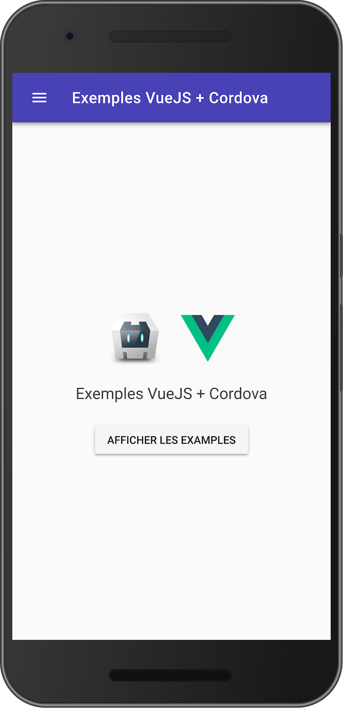

# vuejs-cordova-sample

[](https://travis-ci.org/c4software/vuejs-cordova-sample)

> Sample VueJS app thats use Cordova capabilities



## Build Setup

```bash
# install dependencies
npm install

# serve with hot reload at localhost:8080
npm run serve

# build for production to run in Cordova
npm run build

```

## First Cordova build

Run the command :

```sh
npm run build
cd cordova_app
cordova platform add android
cordova run # or build
```

## Next Cordova build

```sh
npm run cordova_run # or cordova_build
```

## Plugins

- cordova-plugin-dialogs
- cordova-plugin-vibration
- cordova-plugin-geolocation
- cordova-plugin-flashlight
- cordova-plugin-camera
- phonegap-nfc
- cordova-plugin-statusbar
- cordova-plugin-headercolor
